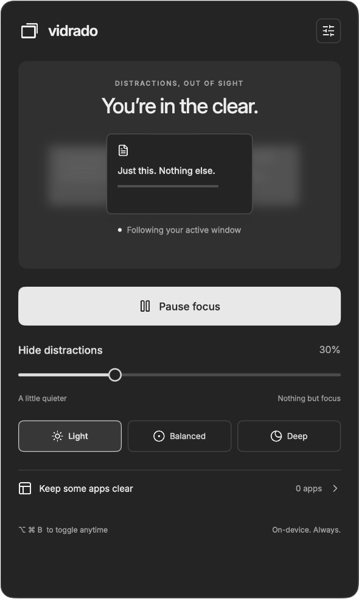
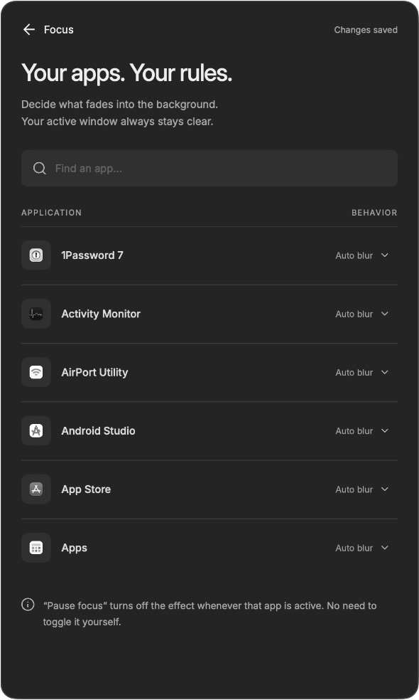
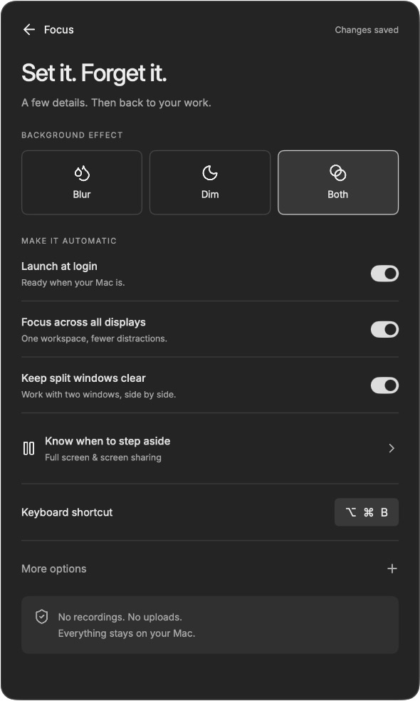

# Vidrado

**پُرسکون ڈیسک ٹاپ۔ صاف ذہن۔**

Vidrado، macOS کے مینو بار کی ایک مقامی ایپ ہے جو پس منظر کی ونڈوز کو دھندلا اور مدھم کرتی ہے، جبکہ فعال ونڈو کو واضح رکھتی ہے۔ یہ مکمل طور پر آپ کے Mac پر کام کرتی ہے، بغیر کسی اکاؤنٹ، سبسکرپشن، ٹریکنگ یا اسکرین ریکارڈنگ کے۔

[ڈاؤن لوڈ کریں](https://github.com/tonhadaplaces/vidrado/releases) · [خرابی کی اطلاع دیں](https://github.com/tonhadaplaces/vidrado/issues/new?template=bug_report.yml) · [تعاون کریں](../../../AGENTS.md)

**زبانیں:** [English](../../../README.md) · [中文](../zh/README.md) · [हिन्दी](../hi/README.md) · [Español](../es/README.md) · [العربية](../ar/README.md) · [Français](../fr/README.md) · [বাংলা](../bn/README.md) · [Português](../pt/README.md) · [Bahasa Indonesia](../id/README.md) · [اردو](../ur/README.md) · [日本語](../ja/README.md) · [한국어](../ko/README.md) · [Русский](../ru/README.md)

## اسے کام کرتے دیکھیں



| ایپس کے قواعد | ترجیحات |
| --- | --- |
|  |  |

## خصوصیات

- پس منظر کو براہِ راست دھندلا یا مدھم کریں، یا دونوں اثرات استعمال کریں؛ شدت جلد بدلنے کے لیے سلائیڈر اور ہلکا، متوازن اور گہرا درجے موجود ہیں۔
- ایپس اور Spaces کے درمیان منتقل ہونے پر فعال ونڈو واضح رہتی ہے۔
- ہر ایپ کے لیے قواعد: پس منظر کی ونڈوز کو خودکار طور پر نرم کریں، کسی ایپ کو واضح رکھیں، یا اس کے فعال ہونے پر فوکس عارضی طور پر روک دیں۔ ایپس کے اصل آئیکن گرے اسکیل میں دکھائی دیتے ہیں۔
- تمام ڈسپلے یا صرف فعال ڈسپلے پر فوکس لگائیں؛ ایک سیدھ میں موجود ونڈوز اور Split View کو برقرار رکھیں۔
- فل اسکرین، اسکرین شیئرنگ، مسلسل کیپچر یا ڈسپلے مررنگ کے دوران فوکس روکنے کا اختیار۔
- اپنی پسند کے مطابق قابلِ تبدیلی گلوبل شارٹ کٹ، کرسر ہلانے کا اختیاری اشارہ اور لاگ اِن پر آغاز۔
- محفوظ شدہ پری سیٹ اور مقامی ترجیحات۔
- انٹرفیس کی تیرہ زبانیں۔ Vidrado آپ کے سسٹم کی بنیادی زبان استعمال کرتا ہے اور غیر معاون زبانوں کے لیے انگریزی پر لوٹتا ہے۔ عربی اور اردو میں ترتیب دائیں سے بائیں ہوتی ہے۔

## انسٹال کریں

**macOS 14 یا اس کے بعد کا ورژن** درکار ہے۔ [Releases](https://github.com/tonhadaplaces/vidrado/releases) سے DMG ڈاؤن لوڈ کریں، اسے کھولیں اور **Vidrado** کو **Applications** میں گھسیٹ کر لے جائیں۔

موجودہ تقسیم میں **ad hoc دستخط** استعمال ہوتے ہیں اور یہ **Apple سے نوٹرائز شدہ نہیں ہے**۔ اگر macOS اس ریپوزٹری سے ڈاؤن لوڈ کی گئی Vidrado ایپ کو کھولنے سے روکے تو قرنطینہ کا وصف صرف اسی ایپ سے ہٹائیں:

```sh
xattr -dr com.apple.quarantine /Applications/Vidrado.app
```

پھر Vidrado دوبارہ کھولیں۔ یہ کمانڈ ایپ کو نوٹرائز نہیں کرتی اور پورے سسٹم کی Gatekeeper ترتیبات نہیں بدلتی۔ چاہیں تو مقامی طور پر بِلڈ کریں۔ خودکار ریلیز کے DMG، **Apple silicon اور Intel** کی معاونت کرتے ہیں۔

## استعمال

فوکس کنٹرول کھولنے کے لیے مینو بار میں ایک دوسرے کے اوپر موجود ونڈوز کے آئیکن پر کلک کریں۔ **⌥⌘B** سے کہیں سے بھی فوکس آن یا آف کیا جا سکتا ہے۔ مینو بار کے آئیکن پر رائٹ کلک یا Option دبا کر کلک کرنے سے بھی یہ آن یا آف ہوتا ہے۔

سلائیڈر والے بٹن یا **⌘,** سے ترجیحات کھولیں۔ **کچھ ایپس واضح رکھیں** میں ایپس منتخب کریں۔ اثرات کے اضافی سلائیڈر، پری سیٹ اور کرسر کا اشارہ **مزید اختیارات** میں موجود ہیں۔ **⌘W** سے ترتیبات کی ونڈو بند کریں؛ Vidrado مینو بار میں چلتی رہے گی۔ **⌘Q** ایپ بند کرتا ہے۔

## بِلڈ اور جانچ

Swift 5.9 یا جدید تر ورژن کے ساتھ Xcode یا Command Line Tools استعمال کریں:

```sh
git clone git@github.com:tonhadaplaces/vidrado.git
cd vidrado
swift run Vidrado --settings
./scripts/build.sh
swift test
./scripts/test.sh
./scripts/package.sh
```

`build.sh`، `dist/Vidrado.app` کو بِلڈ کرتی اور اس پر دستخط کرتی ہے۔ `package.sh`، `dist/Vidrado.dmg` اور اس کا SHA-256 چیک سم بناتی ہے۔ طے شدہ بِلڈ Mac کے آرکیٹیکچر کے لیے ہوتی ہے۔ Apple silicon اور Intel کے لیے بِلڈ بنانے کی خاطر `VIDRADO_UNIVERSAL=1 ./scripts/package.sh` استعمال کریں۔

`swift test` بنیادی XCTest ٹیسٹ چلاتا ہے۔ مکمل جانچ کی اسکرپٹ debug اور release ترتیبوں میں نیٹو جانچ بھی چلاتی ہے۔ ان جانچوں کے لیے غیر مقفل گرافیکل سیشن، سامنے ایک عام ونڈو اور Vidrado کا بند ہونا ضروری ہے۔ GitHub CI بنیادی ٹیسٹ چلاتا اور ایپ کی بِلڈ کی تصدیق کرتا ہے؛ گرافیکل جانچ مقامی طور پر چلتی ہے۔

تعاون کرنے سے پہلے [ریپوزٹری کی ہدایات](../../../AGENTS.md) اور [تصدیق کے نوٹس](../../../TESTING.md) پڑھیں۔ پُل ریکویسٹ استعمال کریں: `main` کے لیے کم از کم ایک منظوری، کامیاب CI اور جائزے کی تمام گفتگوؤں کا حل ضروری ہے۔

## خودکار ریلیز

جائزہ شدہ تبدیلیاں `main` میں ضم ہونے کے بعد، نئے ورژن کے لیے `Resources/Info.plist` میں `CFBundleShortVersionString` اور `CFBundleVersion` اپ ڈیٹ کریں، پھر اس سے مطابقت رکھنے والا ٹیگ پُش کریں:

```sh
git switch main
git pull --ff-only origin main
git tag v1.0.0
git push origin v1.0.0
```

`1.0.0` کی جگہ ریلیز کیے جانے والے ورژن کا نمبر لکھیں۔ GitHub Actions کوڈ کی جانچ کرتا ہے، یونیورسل ایپ بِلڈ کرتا ہے، دستخط شدہ بنڈل اور DMG کی تصدیق کرتا ہے، اور DMG کے ساتھ اس کا SHA-256 چیک سم شائع کرتا ہے۔ ورک فلو تصدیق کرتا ہے کہ ٹیگ `main` پر ہے اور ایپ کے ورژن سے مطابقت رکھتا ہے۔ Apple Developer کی بامعاوضہ اسناد کی ضرورت نہیں؛ ریلیز پر اوپر بیان کردہ ad hoc دستخط کی پابندیاں برقرار رہتی ہیں۔

## رازداری اور تکنیکی حدود

Vidrado ونڈوز کا میٹا ڈیٹا پڑھتی ہے اور فعال ونڈو کے نیچے ایسی تہیں رکھتی ہے جن سے تعامل نہیں کیا جا سکتا۔ macOS کا کمپوزیٹر پس منظر کے براہِ راست مواد پر اثر لگاتا ہے۔ یہ آپ کی دستاویزات نہیں پڑھتی، اسکرین کے فریم کیپچر نہیں کرتی، نیٹ ورک پر ڈیٹا نہیں بھیجتی اور اسے Accessibility کی اجازت درکار نہیں۔

دھندلاہٹ، کلپنگ، شیئرنگ کی شناخت اور Spaces کے میٹا ڈیٹا کے لیے نجی SkyLight فنکشن استعمال ہوتے ہیں جنہیں رن ٹائم پر تلاش کیا جاتا ہے۔ macOS اپ ڈیٹ کے ساتھ ان کی دستیابی بدل سکتی ہے، اور یہ نفاذ Mac App Store کے لیے موزوں نہیں۔ ٹائل کی شکل میں رکھی گئی ونڈوز کی شناخت جیومیٹری سے کی جاتی ہے۔ یہ اثر بصری ہے اور ریکارڈنگ میں حساس مواد چھپانے کا طریقہ نہیں۔

## لائسنس اور شکریہ

[GNU AGPL-3.0](../../../LICENSE)۔ Swift، SwiftUI اور AppKit سے تیار کردہ؛ رن ٹائم کی کوئی بیرونی وابستگی نہیں۔ Inter کو [SIL Open Font License](../../../Sources/VidradoCore/Resources/Brand/Inter-OFL.txt) کے تحت تقسیم کیا جاتا ہے۔ Lucide کے ڈیزائن آئیکن ISC لائسنس استعمال کرتے ہیں؛ [تیسرے فریق کے نوٹس](../../../THIRD_PARTY_NOTICES.md) دیکھیں۔

[Defocus](https://defocus.me/) سے متاثر۔ Vidrado ایک آزاد نفاذ ہے اور Defocus کا سورس کوڈ استعمال نہیں کرتی۔ انٹرفیس کا سورس [`design.pen`](../../../design.pen) کے نام سے ریپوزٹری میں شامل ہے۔
